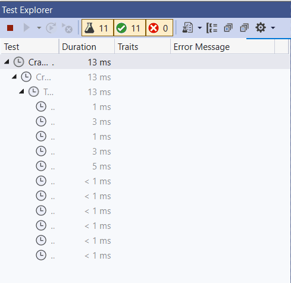

# 2021-COMP1000-Coursework 2
## Dan Livermore 10716150

This is the codebase for my dungeon crawler program.

The program is a game on the commandline, where the player journeys through a 2d map defeating monsters, collecting coins and going to the exit.

The user starts by entering: ``` load Simple.map ``` to load the map for the dungeon. <br />
And then enters: ``` play ``` to start their adventure. <br />


The user controls their character by using the WASD keys followed by ENTER on their keyboard. <br />

The elements on the map represent: <br />
``` @ = The player ``` <br />
``` X = The exit ``` <br />
``` - = The floor ``` <br />
``` # = Walls ``` <br />
``` C = Coins to collect ``` <br />
``` M = Monsters to defeat ``` <br />

To complete the game, the user must get to the X tile.


The user can also start the game in **ADVANCED MODE** by typing in ``` advanced ``` before loading the map. <br />


This also enables other features. In this mode: <br />
- the user can now pick up coins by pressing the P key when their character is ontop of them
- the player can now attack the monsters that are 1 tile adjacent from them
- the user does not need to press ENTER after each input
- the monsters can move
- the user can quickly replay the game once they have escaped the dungeon.

The map is also displayed with different colours for each element of the map <br />
``` @ = Cyan ``` <br />
``` X = Green ``` <br />
```  - = Grey ``` <br />
``` # = White ``` <br />
``` C = Yellow ``` <br />
``` M = Red ``` <br />


Now try to escape the dungeon yourself! <br />

All tests pass.


### Resources used: <br />
[Two-Dimensional arrays in C#](https://docs.microsoft.com/en-us/dotnet/csharp/programming-guide/arrays/multidimensional-arrays)
[Colouring text in C#](https://www.tutorialspoint.com/how-to-change-the-foreground-color-of-text-in-chash-console) <br />
[C# this parameter](https://docs.microsoft.com/en-us/dotnet/csharp/language-reference/keywords/this) <br />


## [Link to demo](https://youtu.be/tw-2qRdt0R0) 

